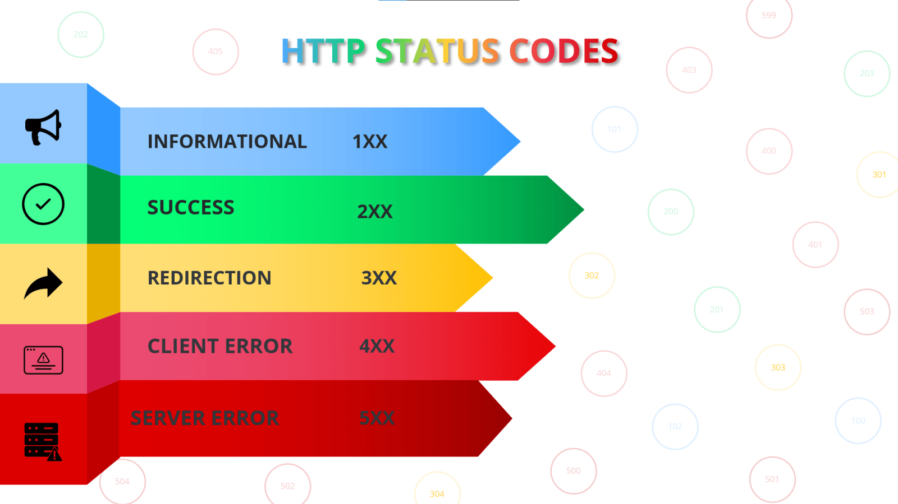

## Instalando Node e Express:
* No terminal do gitbash, dentro da pasta raiz do projeto,  para instalar o node-js, digite `npm init -y`. Transforma uma pasta comum em um projeto node. (Cria uma pasta package.json com suas dependencias).
* Para instalar o express digite `npm install express`. (Cria as pastas package-lock.js, node_modules e atualiza o package.js)
* Criando um arquivo digite `touch server.js` e de um espaço e digite `.gitignore`. (cria as pastas server.js e gitignore)
* Comando para testar o servidor: "node server.js"

____________________________________________________________________________

# Introdução ao Back-end
## O que é o Back-end?
O back-end é a parte de um sistema ou aplicação que funciona nos bastidores, fora da visão direta do usuário. Ele é responsável por garantir que todas as funcionalidades sejam executadas corretamente, processando dados, aplicando regras e interagindo com outras partes do sistema, como bancos de dados e serviços externos.

Se o front-end é o que o usuário vê e interage (as telas, botões e formulários), o back-end é o que faz tudo aquilo “ganhar vida” e realmente funcionar.

### Analogia:
Imagine um teatro.

O palco, atores e cenário visíveis ao público representam o front-end.

A equipe técnica, iluminação, sonoplastia e direção, que coordenam tudo por trás, representam o back-end.

## Funções do Back-end
O back-end atua como o cérebro da aplicação, realizando funções como:

Processar informações enviadas pelo usuário
Sempre que um usuário envia dados — seja para fazer login, cadastrar um produto ou enviar uma mensagem — o back-end interpreta, valida e decide o que fazer com essas informações.

## Aplicar regras de negócio
Toda aplicação segue um conjunto de regras para funcionar. Por exemplo:

Um site de compras não pode vender um produto sem estoque.

Um sistema bancário precisa verificar saldo antes de autorizar uma transferência.

## Gerenciar dados em bancos de dados
O back-end cria, lê, atualiza e apaga dados (operações conhecidas como CRUD).
Ele garante que as informações sejam armazenadas de forma organizada e segura.

## Integrar sistemas
O back-end se conecta a outros serviços e APIs para expandir as funcionalidades, como processadores de pagamento, plataformas de envio de e-mail ou sistemas de geolocalização.

## Garantir segurança e autenticação
É no back-end que se define quem pode acessar o quê, protegendo informações sensíveis e prevenindo acessos não autorizados.

## Principais Elementos do Back-end
### Servidor
O local onde a aplicação back-end “vive” e executa seu trabalho. Pode ser um computador físico, uma máquina virtual ou um serviço na nuvem.

### Aplicação
Conjunto de funcionalidades e regras escritas pelo desenvolvedor que determinam o comportamento do sistema.

### Banco de Dados
Onde as informações são guardadas e organizadas. Pode ser relacional (como MySQL e PostgreSQL) ou não-relacional (como MongoDB).

### APIs
Pontos de acesso que permitem que outras aplicações ou o front-end se comuniquem com o back-end. Elas seguem padrões que facilitam essa comunicação, como REST ou GraphQL.

## Como o Back-end se Comunica com o Front-end
A comunicação acontece por meio de requisições e respostas.

O front-end envia uma requisição ao back-end, pedindo algo (exemplo: “me mostre todos os produtos disponíveis”).

O back-end processa esse pedido, busca as informações necessárias e envia uma resposta de volta (exemplo: uma lista de produtos).

Essa troca é feita usando protocolos como o HTTP e formatos como JSON ou XML para transportar os dados.

## Conceitos Fundamentais para Entender o Back-end
Request (Requisição): O pedido que chega ao servidor, contendo informações sobre o que se quer e, às vezes, dados a serem processados.

Response (Resposta): A mensagem que o servidor envia de volta, com os dados solicitados ou uma confirmação de que algo foi feito.

Endpoint: Endereço específico que o cliente usa para acessar um recurso no servidor.

Rota: Caminho definido dentro da aplicação que determina como tratar cada requisição.

Middleware: Uma etapa intermediária que processa a requisição antes que ela chegue ao destino final. Pode ser usada para autenticação, registro de logs ou manipulação de dados.

## Exemplos de Aplicações que Dependem de Back-end
Redes sociais (armazenam postagens, curtidas, comentários e perfis)

Plataformas de streaming (controlam playlists, histórico e recomendações)

E-commerces (processam compras, pagamentos e entregas)

Aplicativos de transporte (calculam rotas, preços e disponibilidade de motoristas)

Jogos online (sincronizam pontuação, progresso e interações entre jogadores)

### Extra

____________________________________________________________________________

# Arquitetura Cliente Servidor
Até agora, você aprendeu a criar o lado visível de uma aplicação: páginas, estilos, interações no navegador…
Mas a web não é só isso.
Quase tudo que fazemos online envolve pedir e receber dados de algum lugar que não está no nosso computador.

E é aí que entra a arquitetura cliente–servidor.

### Um exemplo que todo mundo entende: Pedir comida
Imagina que você está com fome e abre o iFood no seu celular:

1. Você (cliente): escolhe um prato no aplicativo.

2. O app (front-end): mostra o cardápio, deixa você clicar, digitar observações, escolher forma de pagamento.

3. Servidor do iFood (back-end): recebe seu pedido, registra no sistema, avisa o restaurante e atualiza o status.

4. Restaurante: prepara a comida.

5. Servidor: envia uma mensagem para seu app dizendo “pedido aceito”.

6. Seu celular: exibe essa resposta e atualiza a tela.

Você nunca viu a cozinha, o caixa ou o entregador se organizando.
Mas confia que, se o servidor disse “pedido aceito”, é porque tudo foi feito lá no “mundo invisível” do back-end.

### O que é cliente e o que é servidor?
* Cliente: é o dispositivo, aplicativo ou navegador que faz pedidos. No seu caso como dev, geralmente é o React no navegador do usuário.

* Servidor: é a máquina (normalmente na nuvem) que processa o pedido, aplica regras e responde com algo. Pode ser um texto, uma imagem, um arquivo, um JSON com dados, etc.

A conversa entre eles segue regras, como se fosse um idioma combinado: o protocolo HTTP.

### Como essa conversa acontece na prática?
Quando você digita uma URL e aperta Enter, acontece MUITA coisa em poucos segundos:

1. Tradução do endereço (DNS)
O nome meusite.com é convertido num número chamado endereço IP. É como achar o número de telefone de uma pessoa pelo nome na agenda.

2. Conexão segura (HTTPS)
Cliente e servidor combinam uma forma de trocar dados criptografados (assim ninguém espia no meio do caminho).

3. Requisição
O cliente envia um pedido: “me mande a página inicial” (método GET) ou “registre este usuário” (método POST).

4. Processamento
O servidor recebe o pedido, aplica regras, busca dados no banco e prepara a resposta.

5. Resposta
O servidor devolve: “Toma aqui os dados que você pediu” + um status dizendo se deu certo ou não.

6. Renderização no front-end
O React pega esses dados e atualiza a tela.

### Por que essa arquitetura existe?
Porque não faz sentido colocar todas as regras, dados e segredos dentro do navegador do usuário.
O servidor:

* Protege informações sensíveis (ex.: senhas, pagamentos).

* Centraliza a lógica, para não precisar atualizar milhões de dispositivos.

* Permite que vários clientes diferentes acessem os mesmos dados.

### Ligando com o que vocês já sabem
No React, quando vocês usam um  axios.get( ) para buscar dados de uma API, vocês estão atuando como cliente nessa arquitetura.
O que vocês recebem (JSON, por exemplo) veio do servidor.
O que vocês fazem com esse dado (renderizar lista, filtrar, paginar) é trabalho do front-end.

### Termos que vocês vão ouvir muito
* Request (requisição): pedido enviado ao servidor.

* Response (resposta): o que o servidor devolve.

* Endpoint: endereço específico para acessar algo (ex.: /usuarios para lista de usuários).

* Status HTTP: número que diz o resultado (200 OK, 404 Não encontrado, 500 Erro no servidor).

### Segurança básica na arquitetura
* HTTPS: para proteger os dados durante a transmissão.

* Autenticação: garantir que só quem tem permissão acesse.

* Validação no servidor: o front-end pode validar, mas o back-end é quem decide de verdade o que é aceito.

### Atividade para fixar
Escolha um site ou app que você usa todo dia e descreva:

1. O que é cliente e o que é servidor nesse contexto.

2. Um exemplo de requisição que o app faz (pode inventar).

3. Um exemplo de resposta que ele recebe.

### Extra

Abaixo deixamos dois vídeos para que você possa aprofundar ainda mais seus estudos:

____________________________________________________________________________

# HTTP e seus verbos
O __HTTP (Hypertext Transfer Protocol)__ é um __protocolo de comunicação__ que define __como as mensagens devem ser enviadas e recebidas__ entre clientes (como navegadores) e servidores (onde ficam os sites e APIs).

Um __protocolo__ é como um conjunto de regras ou um manual de instruções:

`Se você quer pedir alguma coisa, fale dessa forma. Se quer responder, responda assim.`

Ele funciona no __modelo cliente-servidor__:

* __Cliente__: Quem faz o pedido (ex.: navegador, aplicativo).

* __Servidor__: Quem recebe o pedido, processa e envia uma resposta.

## Os Principais Verbos HTTP e seus Significados
__GET__
* Função: Pegar/consultar informações.

* Exemplo técnico: O navegador pede ao servidor o conteúdo de uma página.

* Analogia: Pedir para ver o cardápio.

__POST__
* Função: Enviar dados para o servidor criar algo novo.

* Exemplo técnico: Enviar um formulário de cadastro.

* Analogia: Fazer um pedido de comida.

__PUT__
* Função: Enviar dados para atualizar algo que já existe (substituição completa).

* Exemplo técnico: Alterar todos os dados de um perfil.

* Analogia: Trocar todo o prato que pediu por outro.

__DELETE__
* Função: Excluir um recurso.

* Exemplo técnico: Apagar um comentário.

* Analogia: Cancelar o pedido.

## Analogia: Loja Online e Entregas
Imagine que você está usando um aplicativo de compras no seu celular:

* __Você__ → é o __cliente__ (quem faz o pedido).

* __O aplicativo__ → é como a “interface” que você vê (o frontend).

* __O serviço de entregas__ → é o __HTTP__, levando o seu pedido até o __centro de distribuição__ (o servidor) e trazendo a resposta de volta.

* __O centro de distribuição__ → é o __servidor__, onde as mercadorias (dados) estão armazenadas e prontas para serem enviadas ou modificadas.

Agora, dependendo do que você quer fazer no aplicativo, o tipo de pedido muda:

* __GET__ → Você só quer ver os produtos disponíveis. É como abrir o app e olhar o catálogo.

* __POST__ → Você quer adicionar um produto no seu carrinho (ou criar um novo pedido).

* __PUT__ → Você quer alterar seu pedido, trocando um item ou mudando o endereço de entrega.

* __DELETE__ → Você quer cancelar um pedido que fez.

O HTTP funciona exatamente assim:
Você envia o __pedido certo__ (com o verbo correto) e espera que o servidor te responda com o status e o conteúdo solicitado.

### Códigos de Status HTTP
Quando você faz uma requisição HTTP (por exemplo, um __GET, POST, PUT ou DELETE__), o servidor __sempre responde com um número__ que indica __o resultado daquela operação__.
Esse número é o __Código de Status HTTP__.

Faixa____________________________Categoria_______________________Significado geral
1xx_____________________________Informativo_______________________O servidor está processando e ainda não terminou.

2xx______________________________Sucesso________________________A requisição foi recebida e processada com sucesso.

3xx__________________________Redirecionamento____________________O cliente precisa fazer outra ação para completar a requisição.

4xx___________________________Erro do Cliente_____________________O problema veio da requisição enviada (ex.: URL errada).

5xx__________________________Erro do Servidor_____________________O servidor teve um problema interno ao processar.

### Exemplos mais comuns e seu “jeito humano” de responder
#### 2xx - Sucesso
__200 OK__ → “Tudo certo, aqui está o que pediu.”

__201 Created__ → “Tudo certo, e acabei de criar o recurso que você pediu.”

__204 No Content__ → “Deu certo, mas não tenho nada para te mostrar agora.”

#### 3xx - Redirecionamento
__301 Moved Permanently__ → “O que você quer mudou de endereço para sempre. Vá para lá.”

__302 Found__ → “Está temporariamente em outro lugar.”

__304 Not Modified__ → “O conteúdo não mudou desde a última vez, use o que você já tem.”

#### 4xx - Erro do Cliente
__400 Bad Request__ → “Seu pedido veio com erro, não entendi.”

__401 Unauthorized__ → “Você precisa fazer login para acessar isso.”

__403 Forbidden__ → “Mesmo logado, você não tem permissão.”

__404 Not Found__ → “O que você pediu não existe aqui.”

#### 5xx - Erro do Servidor
__500 Internal Server Error__ → “O servidor deu pane, não consegui processar.”

__502 Bad Gateway__ → “Recebi uma resposta inválida de outro servidor.”

__503 Service Unavailable__ → “Estou fora do ar, tente mais tarde.”

### Analogia: Status HTTP como mensagens de entrega
Pensa que você pediu algo num app de delivery:

* 200 → “Pedido entregue com sucesso.”

* 201 → “Pedido registrado, começando a preparar.”

* 404 → “Endereço não encontrado.”

* 500 → “A cozinha pegou fogo, não vai dar pra entregar.”

* 503 → “O restaurante está fechado agora.”

# Endpoints
Endpoint é um __endereço específico do servidor__ que recebe um pedido.

Não é o site inteiro.
Não é “o back-end todo”.

É um caminho específico para uma coisa específica.

Exemplos:

* /users

* /products

* /login

Cada endpoint representa um tipo de dado ou ação.

#### Analogia simples
Imagina um prédio.

* O prédio inteiro é o servidor

* Cada apartamento é um endpoint

Você não toca a campainha do prédio e fala “qualquer coisa”.
Você vai no apartamento certo.

#### Endpoint + verbo = ação
Agora vem a parte mais importante da aula.

O que define o que acontece __não é só o endpoint__,
é o endpoint __junto com o verbo__.

Exemplos:

* __GET /products →__ buscar produtos

* __POST /products →__ criar produto

* __PUT /products/1 →__ atualizar produto

* __DELETE /products/1 →__ apagar produto

Mesmo endereço.
Ações diferentes.

#### Conexão com o que eles já viram
Lembra da aula de consumo de API?

Quando vocês usaram:

`axios.get('https://fakestoreapi.com/products')`

Vocês estavam:

fazendo um __GET__

para o endpoint __/products__

seguindo o padrão HTTP

Vocês já estavam conversando com um back-end.
Só não tinham o nome das coisas ainda.

# Introdução ao Node.js e Express
### O que é Node.js?
O __Node.js__ é um ambiente que permite executar __JavaScript fora do navegador__, diretamente no servidor. Ele é muito usado para criar __APIs, sistemas web, servidores e aplicações em tempo real__.

#### Principais vantagens:
* Alta performance

* Baseado em eventos (não bloqueante)

* Usa JavaScript no backend

* Grande ecossistema de pacotes

### O que é Express?
O __Express.js__ é um __framework minimalista para Node.js__ que facilita a criação de __servidores web e APIs REST__.

#### Com o Express você consegue:
* Criar rotas facilmente

* Trabalhar com requisições HTTP

* Organizar melhor seu projeto

* Criar APIs robustas

## Explicando o NPM
O __NPM (Node Package Manager)__ é o __gerenciador de pacotes do Node.js__.

Ele permite:

* Instalar bibliotecas

* Gerenciar dependências

* Executar scripts