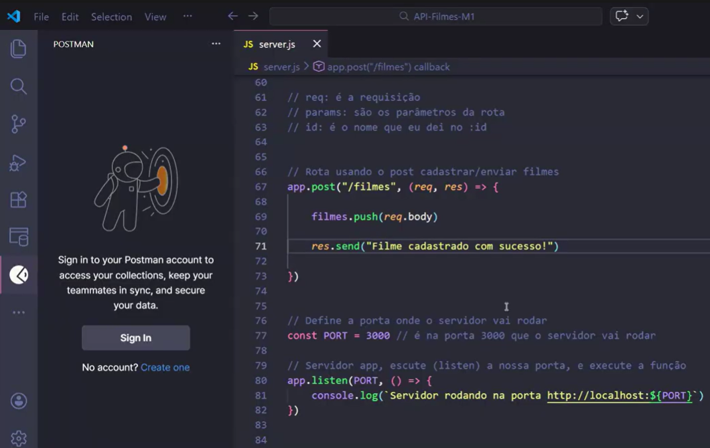
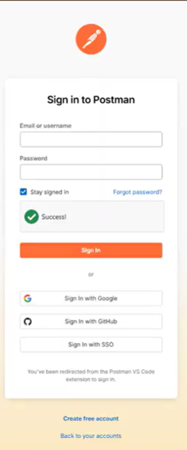
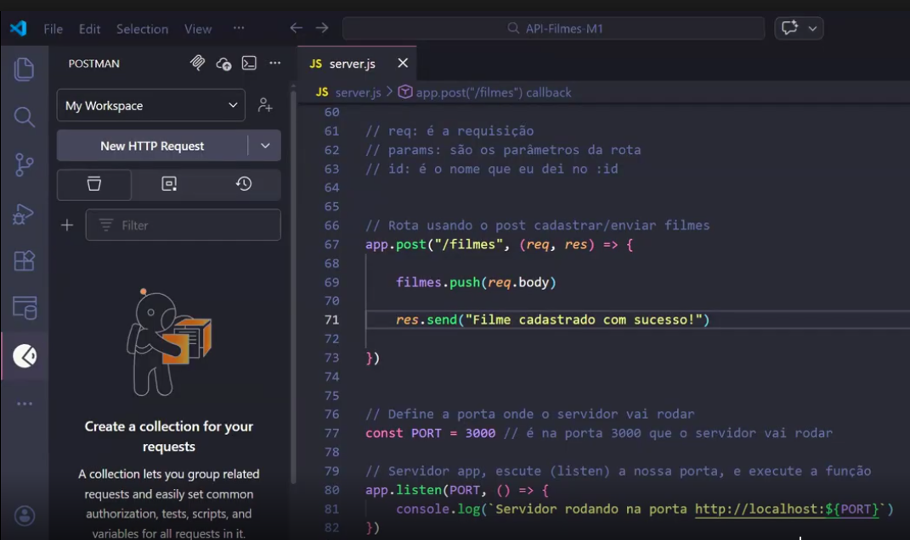
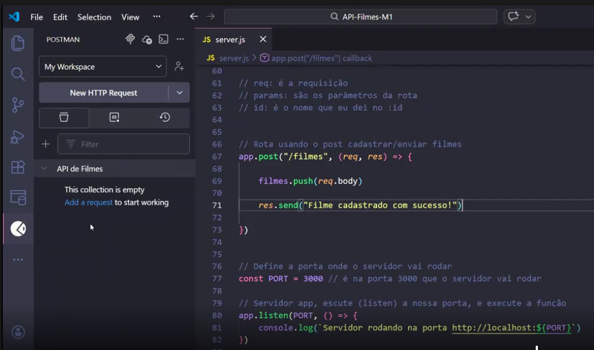
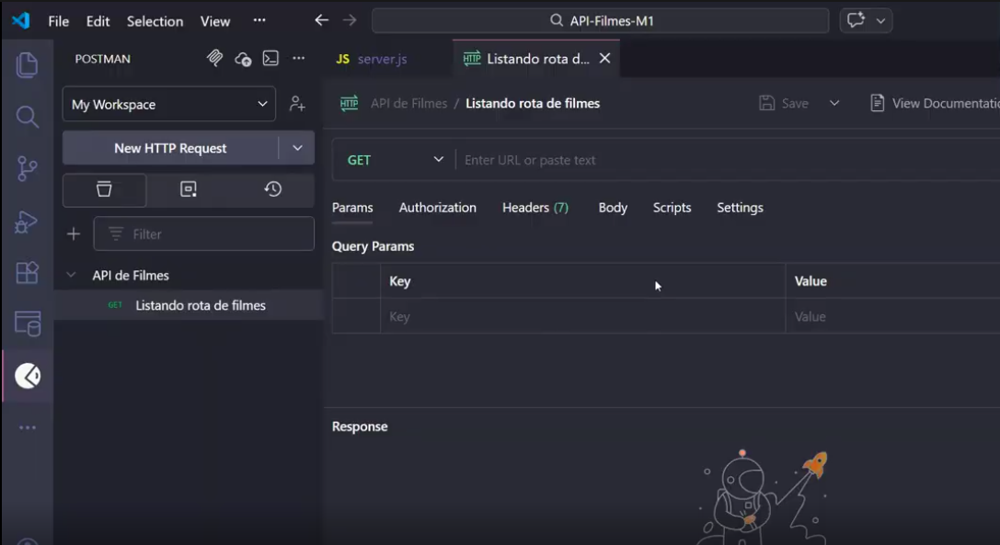

## Instalando Node e Express:
* No terminal do gitbash, dentro da pasta raiz do projeto,  para instalar o node-js, digite `npm init -y`. Transforma uma pasta comum em um projeto node. (Cria uma pasta package.json com suas dependencias).
* Para instalar o express digite `npm install express`. (Cria as pastas package-lock.js, node_modules e atualiza o package.js)
* Para instalar o nodemon `npm install nodemon --save-dev`, va até a pasta package.json, no script vai tar escrito:
  ```
    "scripts": {
    "test": "echo \"Error: no test specified\" && exit 1"
  },
  ```
* escreva no script junto com test:
  ```
    "scripts": {
    "test": "echo \"Error: no test specified\" && exit 1",
    "dev": "nodemon server.js"
  },
  ```
* Criando um arquivo digite `touch server.js` e de um espaço e digite `.gitignore`. (cria as pastas server.js e gitignore)
* Comando para testar o servidor vai trocar de `node server.js"` para `npm run dev`, para fazer o nodemon ficar escutando o servidor caso haja alguma alteração

__________________________________________________________________


# Middleware
Middleware é uma função que fica entre a requisição (req) e a resposta (res).

[](https://www.youtube.com/watch?v=rBGdWQ5MTok&t=4s)

### O que acontece quando alguém acessa sua API?
#### Quando alguém faz uma requisição para sua API, o caminho é:

`Cliente → Servidor → Resposta`
Mas… antes da resposta ser enviada, podemos colocar algo no meio do caminho.

Esse “algo” é o __Middleware__.

## O que é Middleware?
#### Middleware é uma função que executa antes da resposta final ser enviada.
Ele fica entre: 

`Requisição → Middleware → Rota → Resposta`
## O que um middleware pode fazer?
__Ele pode:__
* ✅ Verificar se os dados estão corretos

* ❌ Bloquear a requisição

* 🖥 Mostrar algo no terminal

* ➡ Permitir que a requisição continue

### Analogia
Imagine que sua API é uma festa 🎉
A rota é a entrada.

O middleware é o segurança na porta.

#### Ele decide:
* ✔ Pode entrar → chama next()  é o que permite a requisição continuar.

* ❌ Não pode → bloqueia e envia erro (Barra na porta)

### Estrutura básica:
```
function meuMiddleware(req, res, next) {
  console.log("Passou pelo middleware");
  next();
}
```

* __req → dados que chegam__
* __res → resposta__
* __next() → deixa continuar__
__⚠ Se você não chamar next(), a requisição fica travada.
Exemplo prático: Validando dados__

```
function validarNome(req, res, next) {
  if (!req.body.nome) {
    return res.status(400).json({ mensagem: "O nome é obrigatório" });
  }
  next();
}
```
## O que está acontecendo?
* Se nome não existir → retorna erro 400

* Se existir → permite continuar

## 🚨 IMPORTANTE
req.body só funciona depois que ativamos o middleware express.json()

```
app.use(express.json());
```
Sem isso:

```
console.log(req.body); // undefined
```

## 🚨 Erros Comuns com Middleware
❌ __Tentar pegar com req.body
Parâmetro vem da URL → usar req.params__

❌ __Criar rota genérica antes da específica
Ordem das rotas importa!__
❌ __Esquecer o next()
A requisição fica carregando infinitamente.__
❌ __Não usar return antes do res.status()
O código continua executando depois da resposta.__
❌ __Colocar middleware depois da rota
 Ele nunca será executado.__

## Parâmetros de Rota
São valores dinâmicos dentro da URL.

### O que são?
__São partes variáveis da URL.__
Exemplo:

`/usuarios/1`

O número 1 muda.
Isso é um parâmetro.

### Por que isso é importante?
#### Porque permite buscar algo específico.

### Diferença (sem parâmetro) e (com parâmetro) :
#### Sem parâmetro: Retorna todos.

`/usuarios`

#### Com parâmetro: Retorna só o usuário 1.

`/usuarios/1`

### Estrutura no Express:

```
app.get("/usuarios/:id", (req, res) => {
  const id = req.params.id;
  res.json({ mensagem: `Usuário ${id} encontrado` });
});
```
__:id → diz que é um parâmetro__
__req.params.id → pega o valor da URL__

### Quando usar?
Quando você precisa:

* Buscar por ID

* Buscar por categoria

* Buscar por algo específico

* Atualizar um registro específico

* Deletar um registro específico

## 🚨 Erros Comuns com Parâmetro de rota
### ❌ Esquecer os dois pontos :
#### Errado:

```
/usuarios/id
```

#### Certo: 

```
/usuarios/:id
```

#### ❌ Não converter para número
__Se comparar string com número:__
```
filme.id === req.params.id
```

__Pode não funcionar corretamente.
Por isso usamos:__
```
Number(req.params.id)
```

#### ❌ Não tratar quando não encontra
__Retornar undefined não é profissional.
Sempre trate o caso de erro.__

__________________________________________________________________

# POSTMAN
__Ele simula requisições como se fosse um cliente.__
## Por que não usar só o navegador?
O navegador só envia GET automaticamente.

Mas quando queremos enviar dados (POST), precisamos de uma ferramenta que permita enviar um body.

É aí que entra o Postman.

## Como fazer um POST
1. Escolher método → POST

2. Colocar a URL

3. Ir em Body

4. Selecionar raw

5. Escolher JSON

6. Enviar os dados

#### Exemplo:
```
{
  "nome": "Maria",
  "idade": 22
}
```

#### Ela permite enviar:
* GET

* POST

* PUT

* DELETE

__Mesmo que o navegador só envie GET automaticamente.__

## Por que usar?
Quando usamos POST, estamos enviando dados no __body da requisição__.
O navegador não faz isso sozinho.

Por isso usamos o Postman para:

✔ Criar dados
✔ Testar APIs
✔ Simular requisições reais

## Exemplo de uso
1. Escolher método (POST)

2. Inserir URL

3. Ir em Body → raw → JSON

4. Enviar os dados

## 🚨 Erros Comuns no Postman
#### ❌ Esquecer de colocar Body como JSON
#### O servidor não entende os dados.
#### ❌ Não usar app.use(express.json())
 #### req.body vem undefined.
#### ❌ Enviar POST para rota que só aceita GET
#### Vai dar erro 404 ou método não permitido.

## Get e Post
### Extensão POSTMAN


#### Sign In



#### Sign in with GitHub



#### New Collection (API Filmes)



#### Add Request (Listando rota de Filmes)





#### GET -> Enter URL  ->  http://localhost:3000/filmes


#### Add Request (Postando na rota de Filmes)


#### POST -> http://localhost:3000/filmes -> Body -> raw -> Escrever o Objeto  em formato JSON -> Send


#### Middleware
Permite que o servidor entenda dados enviados em JSON no body. Ele executa antes da resposta final. Fica entre a requisição e a resposta.


No arquivo server.js, inserir o código: 

```
app.use(express.json());
```


__________________________________________________________________

# Postman
É uma plataforma abrangente para o ciclo de vida de APIs, amplamente utilizada por desenvolvedores para projetar, construir, testar, documentar e compartilhar APIs de forma colaborativa. Originalmente conhecido como um cliente HTTP, ele evoluiu para uma ferramenta completa que facilita a comunicação entre cliente e servidor, simulando requisições e visualizando respostas.

## Principais funcionalidades do Postman:
* ### Envio de Requisições HTTP/API: 
  Permite testar APIs enviando solicitações como GET, POST, PUT, DELETE, PATCH, entre outras, facilitando a validação antes da integração.
* ### Gestão de Coleções (Collections): 
  Organiza requisições relacionadas em pastas, facilitando o compartilhamento com a equipe e o fluxo de trabalho.
* ### Ambientes (Environments): 
  Permite configurar variáveis de ambiente (como URLs de desenvolvimento, homologação e produção) para reutilizar requisições em diferentes cenários sem alterar o código manualmente.
* ### Automação de Testes: 
  Possui scripts baseados em JavaScript para validar respostas da API, garantindo a qualidade e confiabilidade do software antes do lançamento.
* ### Documentação Automatizada: 
  Cria documentações técnicas automaticamente a partir das coleções de requisições, facilitando a compreensão para outros desenvolvedores.
* ### Simulação de Respostas (Mock Servers): 
  Permite simular respostas de API (mocking) para desenvolver funcionalidades frontend mesmo quando o backend ainda não está pronto.
* ### Suporte a Autenticação: 
  Compatível com diversos métodos de segurança, incluindo OAuth, API Keys, Bearer Tokens e Basic Auth.
* ### Geração de Código: 
  Gera trechos de código (snippets) em várias linguagens e bibliotecas, como Python (requests) e Node.js (axios), para acelerar a implementação.