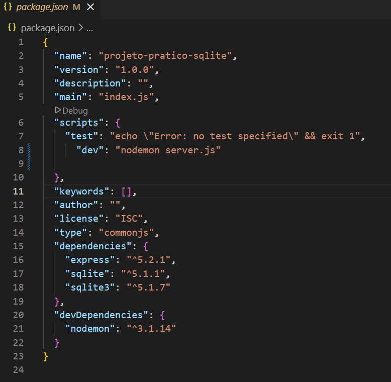

## Instalando Node e Express:
* No terminal do gitbash, dentro da pasta raiz do projeto,  para instalar o node-js, digite `npm init -y`. Transforma uma pasta comum em um projeto node. (Cria uma pasta package.json com suas dependencias).
* Para instalar o express digite `npm install express`. (Cria as pastas package-lock.js, node_modules e atualiza o package.js)
* Para instalar o nodemon `npm install nodemon --save-dev`, va até a pasta package.json, no script vai tar escrito:
  ```
    "scripts": {
    "test": "echo \"Error: no test specified\" && exit 1"
  },
  ```
* escreva no script junto com test:
  ```
    "scripts": {
    "test": "echo \"Error: no test specified\" && exit 1",
    "dev": "nodemon database.js"
  },
  ```
* Instalando o sqLite `npm install sqlite3 sqlite`
* Criando um arquivo digite `touch server.js`, de um espaço e digite `.gitignore` e  de um espaço e digite `database.js`. (cria as pastas server.js, .gitignore e database)
* Comando para testar o servidor vai trocar de `node server.js"` para `npm run dev`, para fazer o nodemon ficar escutando o servidor caso haja alguma alteração

---

# Projeto Zela cidade


## 🧱 Estrutura do Projeto
Até agora, trabalhamos com códigos separados.
Mas em aplicações reais, precisamos organizar melhor para que tudo funcione junto.
Cada arquivo tem uma responsabilidade.

```/projeto
  ├── server.js
  ├── database.js
  ├── database.db
  ├── package.json
```
### server.js (O Cérebro da API)
Responsável por:
* Criar o servidor

* Definir rotas

* Responder requisições

É quem conversa com o usuário

### database.js (O Acesso ao Banco)
 Responsável por:
* Criar conexão com SQLite

* Executar comandos SQL

É quem conversa com o banco de dados
### database.db (Os Dados)
 Contém:
* Tabelas

* Registros

É onde os dados ficam guardados
### package.json (Configuração do Projeto)
Responsável por:
* Dependências

* Scripts (ex: nodemon)

É o “controle” do projeto
✔ Cada arquivo tem uma função
✔ O server controla tudo
✔ O database responde ao server
✔ O usuário nunca acessa o banco direto

## 🧠 Fluxo de uma requisição
Como tudo se conecta
```
Usuário → rota (/incidentes)
        → server.js
        → database.js
        → banco
        ← dados (JSON)
```
1. O usuário faz um pedido (URL)

2. O servidor recebe

3. O servidor pede dados ao banco

4. O banco responde

5. O servidor devolve para o usuário

## 🔗 Conexão entre arquivos
### Exportando (database.js)
```
module.exports = { criarBanco };
```

### Importando (server.js)
```
const { criarBanco } = require('./database');
```
Estamos “emprestando” uma função de um arquivo para outro
## ⚠️ Ponto importante
O banco não roda sozinho
Antes:
```
criarBanco();
```

Agora:
```
// criarBanco();
```

Quem controla o banco agora é o servidor

## ⚙️ Quem inicia o projeto?
### O server.js
package.json
```
"dev": "nodemon server.js"
```

O servidor é o ponto de partida



## 🏙️ Gestão de Problemas Urbanos (ZelaCidade)
### 🚧 Cenário
Imagine que um cidadão encontra um problema na cidade, como:

* Buraco na rua

* Lâmpada quebrada

* Lixo acumulado

Ele precisa registrar isso no sistema.

### 🧩 Quem é quem no sistema?
**📱 Usuário (cidadão) → Quem registra ou **consulta problemas

**🧑‍💼 server.js (API)** → Central da prefeitura

**🗂️ database.js** → Funcionário que acessa os registros

**🗄️ database.db** → Arquivo com todos os problemas da cidade

### 🔄 Como funciona na prática

```
Cidadão → Central (API) → Sistema interno → Banco de dados
                        ← dados ←
```

### Explicação:
O cidadão faz uma solicitação:  “Quero ver os problemas registrados”

A central da prefeitura recebe:  (server.js)

A central pede ao sistema interno:  (database.js)

O sistema busca no banco: (database.db)

A resposta volta para o cidadão:  em formato JSON

O cidadão faz o pedido → a prefeitura organiza → o sistema busca → a resposta volta

### 🔄Como funciona dentro do sistema
#### 🔎 Buscar todos os problemas
📍 URL:
```
GET /incidentes
```

Mostre todos os problemas registrados na cidade

#### 🔍 Buscar um problema específico
📍 URL:
```
GET /incidentes/2
```

Mostre o problema de ID 2
### 🚫 O que NÃO acontece
❌ O cidadão não acessa o banco diretamente
❌ Não escreve SQL
❌ Não mexe nos arquivos

**Tudo passa pela API**
### 🎯 Resumo Final
|Sistema                     |Vida real                  |
|----------------------------|---------------------------|
|API (server.js)             |Central da prefeitura      |
|database.js                 |Funcionário interno        |
|database.db                 |Arquivo da cidade          |
|GET                         |Consulta de problemas      |

**A API funciona como a central da prefeitura, recebendo solicitações dos cidadãos e buscando as informações no sistema interno.**
**API = ponte entre usuário e banco**
**GET = buscar dados**
**JSON = resposta**

## 🧪 Testando a API
Testando na prática (Postman/Navegador)

### Adicionar:
URL:
```
http://localhost:3000/incidentes
```

### O que esperar:
**Um JSON com lista de incidentes**

## ⚠️ Erros comuns
**Exemplos:**
❌ esquecer o await

❌ não exportar criarBanco

❌ rota digitada errado

❌ banco não conectado

## 💻 Código completo da rota GET
server.js
```
// Importa o framework Express (ele facilita a criação de servidores web)
const express = require('express');

// Importa a função criarBanco do arquivo database.js
// Essa função provavelmente faz a conexão com o banco de dados
const { criarBanco } = require('./database');

// Cria a aplicação (nosso servidor)
const app = express();

// Middleware que permite que o servidor entenda JSON
// Ex: quando enviamos dados pelo Postman ou frontend
app.use(express.json());


// ROTA INICIAL
app.get("/", (req, res) => {
  res.send(`
        <body>
            <h1>ZelaCidade</h1>
        </body>
        `);
});


// ROTA DE LISTAGEM (retorna TODOS os incidentes)
app.get('/incidentes', async (req, res) => {
    // Conecta ao banco de dados
    const db = await criarBanco();

    // Executa uma query SQL que busca todos os registros
    const incidentes = await db.all('SELECT * FROM incidentes');

    // Retorna os dados em formato JSON
    res.json(incidentes);
});

// DEFINE A PORTA DO SERVIDOR
const PORT = 3000;


// 🚀 INICIA O SERVIDOR
app.listen(PORT, () => {

    // Mensagem que aparece no terminal
    console.log(`Servidor rodando em http://localhost:${PORT}`);
});


// ROTA DE LISTAGEM POR ID (retorna um incidente específico)
app.get("/incidentes/:id", async (req, res) => {

  // req.params pega valores da URL
  // Ex: /incidentes/2 → id = 2
  const { id } = req.params;

  // Conecta ao banco
  const db = await criarBanco();

  // Busca um registro específico usando o ID
  const incidenteEspecifico = await db.all(
    `SELECT * FROM incidentes WHERE id = ?`,
    [id],
  );

  // O '?' é um placeholder (espaço reservado)
  // Isso evita SQL Injection (ataques no banco de dados)

  // Retorna o resultado
  res.json(incidenteEspecifico);
});
```

### O que está acontecendo nesse código?

Criamos o servidor

Criamos a rota

Buscamos no banco

Devolvemos os dados